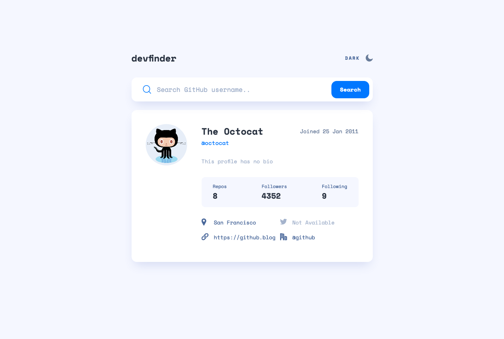

# Frontend Mentor - GitHub user search app solution

This is a solution to the [GitHub user search app challenge on Frontend Mentor](https://www.frontendmentor.io/challenges/github-user-search-app-Q09YOgaH6). Frontend Mentor challenges help you improve your coding skills by building realistic projects.

## Table of contents

- [Overview](#overview)
  - [The challenge](#the-challenge)
  - [Screenshot](#screenshot)
  - [Links](#links)
- [My process](#my-process)
  - [Built with](#built-with)
  - [What I learned](#what-i-learned)

## Overview

### The challenge

Users should be able to:

- View the optimal layout for the app depending on their device's screen size
- See hover states for all interactive elements on the page
- Search for GitHub users by their username
- See relevant user information based on their search
- Switch between light and dark themes
- **Bonus**: Have the correct color scheme chosen for them based on their computer preferences. _Hint_: Research `prefers-color-scheme` in CSS.

### Screenshot

### Links

- Solution URL: [https://github.com/TheFranMan/github-user-search-app](https://github.com/TheFranMan/github-user-search-app)
- Live Site URL: [https://confident-wozniak-4a5bf6.netlify.app/](https://confident-wozniak-4a5bf6.netlify.app/)

## My process

### Built with

- Semantic HTML5 markup
- Flexbox
- CSS Grid
- Mobile-first workflow
- [React](https://reactjs.org/) - JS library

### What I learned

   * Learned how to use React hooks `useContext`, `useReducer`, and `useEffect`.
   * Further increased my knowlage on how React uses state to rerender a page.
   * This was also my first project using CSS Grid. Bit of a learning curve, but I got there in the end.
   * Implemented `prefers-color-scheme` in js to create a dark/light mode switcher.
